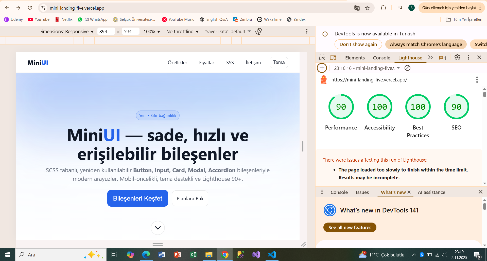

# MiniUI — Sade, Hızlı ve Erişilebilir UI Bileşenleri

🌐 **Canlı Demo:** [https://mini-landing-five.vercel.app](https://mini-landing-five.vercel.app)

## 📊 Lighthouse Raporu

| Kategori | Puan |
|-----------|------|
| ⚡ Performance | 90 |
| ♿ Accessibility | 100 |
| 🧱 Best Practices | 100 |
| 🔍 SEO | 90 |

> Ortalama Skor: **95 / 100**

**MiniUI**, modern web projeleri için oluşturulmuş, SCSS tabanlı, yeniden kullanılabilir bir **mini UI kütüphanesidir**.  
Harici hiçbir UI kütüphanesi kullanılmadan geliştirilmiştir.  
Proje, **semantik HTML**, **modern SCSS**, **temalar (light/dark)** ve **erişilebilir bileşenler (a11y)** odaklıdır.

---

## 🚀 Özellikler

- 🎨 **SCSS tabanlı modüler yapı**  
- 🧩 **Yeniden kullanılabilir bileşenler:** Button, Card, Modal, Accordion, Input  
- 📱 **Mobil öncelikli tasarım (320px–1440px arası responsive)**  
- 🌗 **Light/Dark tema geçişi (CSS değişkenleriyle)**  
- ♿ **Erişilebilirlik (ARIA etiketleri, klavye navigasyonu)**  
- ⚡ **Yüksek performans (Lighthouse 90+ hedefi)**

---

## 🧱 Kullanılan Teknolojiler

- **Vite + React + TypeScript**  
- **SCSS (CSS Modules)**  
- **Vanilla JS etkileşimleri** (Accordion, Theme Toggle)  
- **ESLint + Prettier** (kod standartları için)

---

## 🗂️ Proje Yapısı
# MiniUI — Sade, Hızlı ve Erişilebilir UI Bileşenleri

**MiniUI**, modern web projeleri için oluşturulmuş, SCSS tabanlı, yeniden kullanılabilir bir **mini UI kütüphanesidir**.  
Harici hiçbir UI kütüphanesi kullanılmadan geliştirilmiştir.  
Proje, **semantik HTML**, **modern SCSS**, **temalar (light/dark)** ve **erişilebilir bileşenler (a11y)** odaklıdır.

---

## 🚀 Özellikler

- 🎨 **SCSS tabanlı modüler yapı**  
- 🧩 **Yeniden kullanılabilir bileşenler:** Button, Card, Modal, Accordion, Input  
- 📱 **Mobil öncelikli tasarım (320px–1440px arası responsive)**  
- 🌗 **Light/Dark tema geçişi (CSS değişkenleriyle)**  
- ♿ **Erişilebilirlik (ARIA etiketleri, klavye navigasyonu)**  
- ⚡ **Yüksek performans (Lighthouse 90+ hedefi)**

---

## 🧱 Kullanılan Teknolojiler

- **Vite + React + TypeScript**  
- **SCSS (CSS Modules)**  
- **Vanilla JS etkileşimleri** (Accordion, Theme Toggle)  
- **ESLint + Prettier** (kod standartları için)

---

